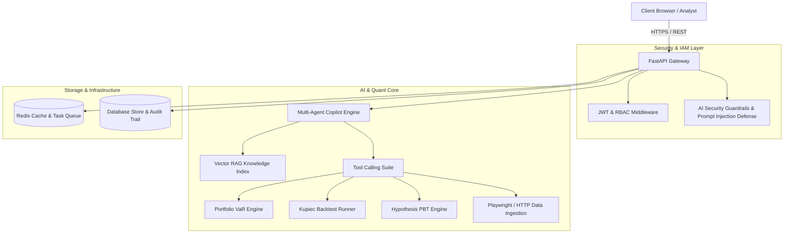

# 📊 QuantRisk Enterprise: Full-Stack AI, Data, Infrastructure & Security Platform

[](https://github.com/gurveenarora/quant-risk-ai-platform/actions/workflows/ci.yml)
[](https://www.python.org/downloads/)
[](https://fastapi.tiangolo.com/)
[](LICENSE)

An end-to-end production platform for quantitative portfolio risk modeling, Kupiec backtesting, Hypothesis property-based fuzz testing, Agentic AI copilot workflows, Playwright web scraping, and AI security guardrails.

Built directly on published quantitative research:
1. 📄 **[Calculating Portfolio Risk: Historical vs. Parametric Value at Risk (VaR) in Python](https://the-applied-quant.hashnode.dev/calculating-portfolio-risk-historical-vs-parametric-value-at-risk-var-in-python)**
2. 📄 **[Bulletproofing Quantitative Risk Models: Property-Based Testing for Portfolio VaR & Kupiec Backtests in Python](https://the-applied-quant.hashnode.dev/bulletproofing-quantitative-risk-models-property-based-testing-for-portfolio-var-kupiec-backtests-in-python)**

---

## 🌟 Key Engineering Highlights & Skills Coverage

| Technical Domain | Enterprise Implementations |
|---|---|
| **AI / ML & Agentic AI** | • Multi-Agent Copilot with tool execution (`run_var_analysis`, `run_kupiec_backtest`, `run_pbt_suite`, `scrape_market_data`).<br>• Vector RAG Retrieval Engine over published research papers.<br>• LLM fine-tuning dataset builder (JSONL) & evaluation harness (BLEU / ROUGE). |
| **Quantitative Modeling** | • Historical VaR (empirical quantile) vs. Parametric VaR (variance-covariance with $\mu$ & $\sigma$).<br>• Kupiec Proportion-of-Failures (POF) Likelihood Ratio test ($LR_{POF} = -2\ln[...] \sim \chi^2(1)$).<br>• Higher-order statistical moments (Excess Kurtosis & Skewness) for fat-tail risk detection. |
| **Testing & Verification** | • Hypothesis Property-Based Testing (PBT) suite fuzzing 100+ randomized market scenarios.<br>• Universal mathematical invariant assertions (monotonicity, scale bounds, non-negative volatility). |
| **Automation & Data ETL** | • Playwright async headless browser data extraction pipeline with HTTPX / BeautifulSoup fallbacks.<br>• Multi-asset return normalization & covariance matrix calculation. |
| **Security & IAM/RBAC** | • Dual-stage AI Security Guardrails (prompt injection regex/LLM classifier & data leakage masking).<br>• JWT authentication, password hashing, and Role-Based Access Control (`Admin`, `QuantAnalyst`, `Auditor`). |
| **Infrastructure & DevOps** | • Multi-container Docker setup (`api`, `frontend`, `redis`, `prometheus`).<br>• Terraform Infrastructure as Code (IaC) templates for AWS ECS & ElastiCache.<br>• GitHub Actions CI/CD pipeline automation. |

---

## 🏗️ System Architecture



---

## 🚀 Quick Start (Local Setup)

### Option 1: Python & Local Server
```bash
# 1. Clone repository
git clone https://github.com/gurveenarora/quant-risk-ai-platform.git
cd quant-risk-ai-platform/backend

# 2. Install dependencies
pip install -r requirements.txt

# 3. Launch application server
python -m uvicorn app.main:app --host 0.0.0.0 --port 8080
```
Open **`http://localhost:8080`** in your browser!

### Option 2: Docker Compose (Zero-Config)
```bash
docker-compose up --build
```

---

## 🧪 Automated Testing

Run unit & Hypothesis property-based test suite:
```bash
cd backend
python -m pytest tests -v
```

Output:
```text
============================= test session starts =============================
tests/test_kupiec_backtest.py::test_kupiec_output_invariants PASSED      [ 20%]
tests/test_kupiec_backtest.py::test_kupiec_perfect_fit PASSED            [ 40%]
tests/test_portfolio_var.py::test_calculate_log_returns_properties PASSED [ 60%]
tests/test_portfolio_var.py::test_historical_var_invariants PASSED       [ 80%]
tests/test_portfolio_var.py::test_parametric_var_invariants PASSED       [100%]
============================== 5 passed in 2.95s ==============================
```

---

## 📄 References & Research

- **Hashnode Publication**: [https://the-applied-quant.hashnode.dev/](https://the-applied-quant.hashnode.dev/)
- **Author**: Gurveen Arora
